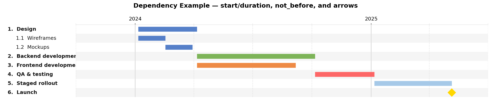
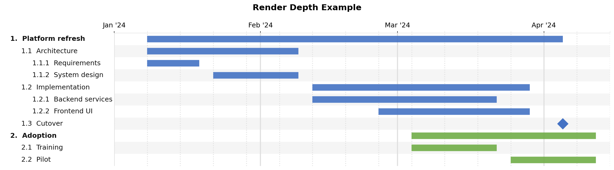
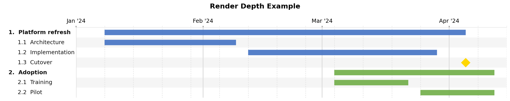
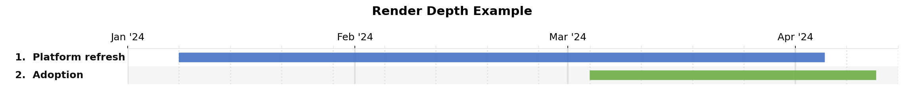
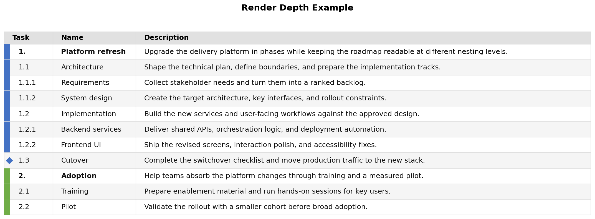
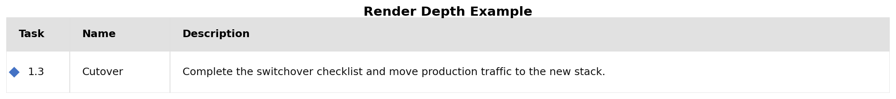
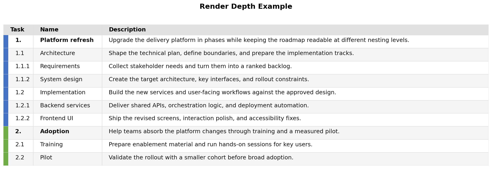
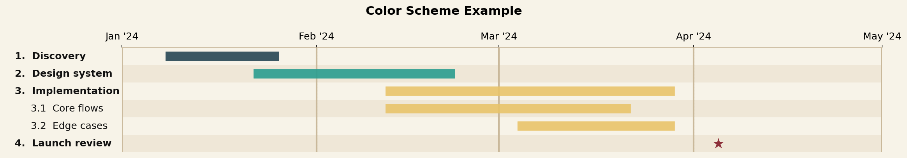
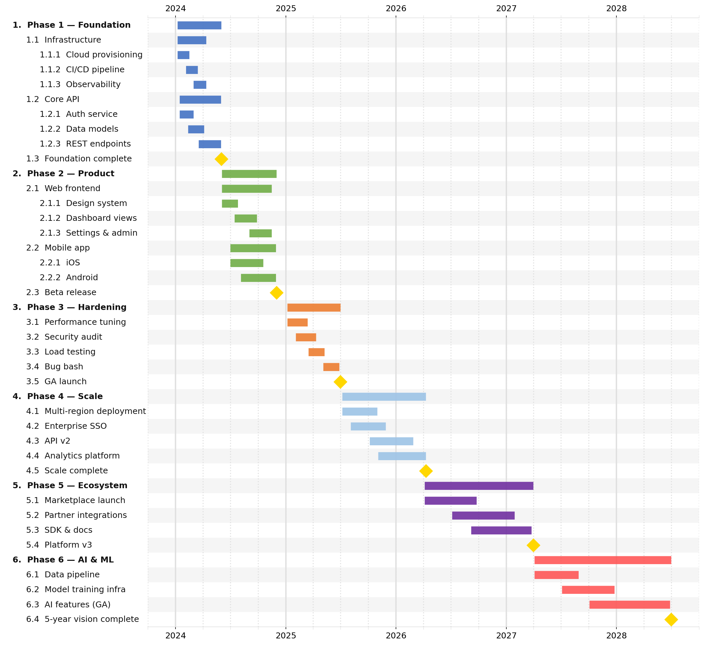

# jsonantt

**jsonantt** generates beautiful Gantt chart images from a simple JSON description.  
Charts are rendered with [matplotlib](https://matplotlib.org/) so they can be saved as `.png`, `.pdf`, `.svg`, and more.

---

## Features

- **Infinitely nestable tasks** — define sub-tasks, sub-sub-tasks, etc.
- **Auto date computation** — parent task start/end are derived automatically from children when not specified.
- **Milestone markers** — easy `"milestone": true` flag renders a distinctive diamond.
- **Optional task descriptions** — add long-form context per task for table-style output.
- **Fully colourable** — set colours per-task; children inherit their parent's colour.
- **Clean, indented y-axis labels** — task names are left-aligned with proper indentation per depth level.
- **Table output mode** — render a task summary table with the same hierarchy and colour cues.
- **PNG / PDF / SVG output** — whatever matplotlib supports.

---

## Installation

```bash
pip install jsonantt
```

Or, directly from source:

```bash
git clone https://github.com/briday1/jsonantt.git
cd jsonantt
pip install -e .
```

---

## Quick start

### 1. Create a JSON description

```json
{
  "title": "My Project",
  "dateformat": "%Y-%m-%d",
  "tasks": [
    {
      "name": "Phase 1 – Planning",
      "children": [
        { "name": "Requirements", "start": "2024-01-08", "end": "2024-01-19" },
        { "name": "Architecture",  "start": "2024-01-15", "end": "2024-01-31" }
      ]
    },
    { "name": "Planning done", "milestone": true, "date": "2024-01-31" },
    {
      "name": "Phase 2 – Build",
      "color": "#70AD47",
      "children": [
        { "name": "Backend",  "start": "2024-02-01", "end": "2024-03-01" },
        { "name": "Frontend", "start": "2024-02-12", "end": "2024-03-08" }
      ]
    },
    { "name": "Launch", "milestone": true, "date": "2024-04-01", "color": "#FF5757" }
  ]
}
```

### 2. Generate the chart or table

**CLI:**

```bash
jsonantt project.json project.png
jsonantt project.json project.pdf   # vector PDF
jsonantt project.json project.svg   # scalable SVG
jsonantt --dpi 300 project.json project.png   # high-resolution PNG
jsonantt -r 1 project.json project.png   # top-level tasks only
jsonantt --renderdepth 2 project.json project.png   # include one child level
jsonantt -t project.json project-table.png   # task name / description table
jsonantt -t project.json project-table.csv   # CSV table export
```

**Python API:**

```python
from jsonantt import load_chart, render_chart, render_table

config = load_chart("project.json")
render_chart(config, "project.png", dpi=150)
render_chart(config, "summary.png", dpi=150, render_depth=1)
render_table(config, "project-table.png", dpi=150)
```

`render_depth=0` renders all nested levels. `1` renders only top-level tasks, `2` includes one level of children, and so on.

`--table` / `-t` switches the output to a three-column table with `Task`, `Name`, and `Description`. The `Task` column keeps hierarchy numbering, the `Name` column stays unindented, `style.table_colorize` controls the side color accent, and `style.table_show_markers` controls whether milestone rows use a diamond marker in that gutter.

`--milestones-only` works with `--table` to render only milestone rows in a dedicated milestone table. `--no-milestones` does the opposite and excludes milestones.

If the table output path ends in `.csv`, `jsonantt` writes CSV instead of an image.

---

## JSON reference

| Field | Type | Description |
|-------|------|-------------|
| `title` | string | Optional chart title shown at the top |
| `dateformat` | string | `strptime` format string (default: `"%Y-%m-%d"`) |
| `start` | date string | Optional chart x-axis start date (overrides task dates) |
| `end` | date string | Optional chart x-axis end date |
| `style` | object | Visual style overrides (see below) |
| `tasks` | array | Top-level list of task objects |

### Task object

| Field | Type | Description |
|-------|------|-------------|
| `name` | string | **Required.** Task label |
| `description` | string | Optional long-form text used by table output |
| `id` | string | Unique identifier used for `not_before` references |
| `start` | date string | Bar start date |
| `end` | date string | Bar end date |
| `duration` | string or int | Duration from `start` (or resolved `not_before` end): `"14d"`, `"2w"`, `"3m"`, `"2y"`, or a plain integer (days) |
| `not_before` | string | `id` of another task — this task starts immediately after that task ends |
| `color` | CSS hex string | Bar/milestone colour (e.g. `"#4472C4"`) |
| `milestone` | boolean | Render as a diamond milestone instead of a bar |
| `date` | date string | Milestone date (used when `milestone: true`) |
| `marker_size` | number | Override milestone diamond size in points |
| `bold` | boolean | Render label in bold (top-level tasks are auto-bolded by default) |
| `children` | array | Nested sub-tasks (infinitely nestable) |

> **Auto date computation:** When a task has `children` but no explicit `start`/`end`, the dates are computed automatically as the earliest child start and latest child end, recursively.

> **Duration formats:** `d`/`day`/`days`, `w`/`week`/`weeks`, `m`/`month`/`months`, `y`/`year`/`years` — e.g. `"14d"`, `"2w"`, `"3m"`, `"1y"`.

### Style object

| Field | Default | Description |
|-------|---------|-------------|
| `width` | `14` | Figure width in inches |
| `row_height` | `0.3` | Height of each task row in inches |
| `bar_height` | `0.5` | Bar height as a fraction of `row_height` |
| `font_size` | `12` | Base font size in points |
| `indent_size` | `3` | Spaces added per depth level in labels |
| `label_fraction` | `0.28` | Fraction of figure width used for labels |
| `colors` | palette | Array of default hex colours cycled per top-level task |
| `background` | `"#FFFFFF"` | Figure background colour |
| `grid_color` | `"#E0E0E0"` | Vertical gridline colour |
| `row_band_color` | `"#F5F5F5"` | Alternating row band colour |
| `milestone_color` | `"#E65100"` | Default milestone colour |
| `milestone_size` | `14` | Default milestone diamond size in points |
| `major_tick` | `null` | Major tick unit: `"year"`, `"quarter"`, `"month"`, `"week"` |
| `minor_tick` | `null` | Minor tick unit: `"quarter"`, `"month"`, `"week"`, `"day"` |
| `major_grid_width` | `2.0` | Major gridline linewidth |
| `minor_grid_width` | `1.5` | Minor gridline linewidth |
| `tick_position` | `"top"` | X-axis label position: `"top"`, `"bottom"`, or `"both"` |
| `bold_tasks` | `true` | Auto-bold top-level (depth 0) task labels |
| `number_tasks` | `true` | Prefix task labels with hierarchy numbers like `1`, `1.1`, `1.2` |
| `table_colorize` | `true` | Show a task-coloured accent bar in table output; when `false`, both accent bars and milestone markers are suppressed |
| `table_show_markers` | `true` | Replace the accent bar with a milestone diamond for milestone rows in table output when table colours are enabled |

---

## Examples

See the [`examples/`](examples/) folder for ready-to-run JSON files.

### Simple project

[`examples/simple.json`](examples/simple.json) — a five-phase project with milestones


### Dependencies

[`examples/dependencies.json`](examples/dependencies.json) — `id`, `duration`, and `not_before`



### Render depth

[`examples/renderdepth.json`](examples/renderdepth.json) — nested tasks that are useful with `-r` / `--renderdepth`

This example also sets `style.number_tasks` to `false`, so indentation is preserved while task numbering is suppressed.

Full depth, `render_depth=0`:



One child level, `-r 2`:



Top level only, `-r 1`:



Table output, `-t`:



Milestones only, `-t --milestones-only`:



No milestones, `-t --no-milestones`:



Try the same file with different depth limits:

```bash
jsonantt examples/renderdepth.json examples/renderdepth-all.png      # full depth
jsonantt -r 1 examples/renderdepth.json examples/renderdepth-top.png # top-level only
jsonantt -r 2 examples/renderdepth.json examples/renderdepth-mid.png # one child level
jsonantt -t examples/renderdepth.json examples/renderdepth-table.png # task table view
jsonantt -t --milestones-only examples/renderdepth.json examples/renderdepth-milestones.png # milestones only
jsonantt -t --no-milestones examples/renderdepth.json examples/renderdepth-no-milestones.png # exclude milestones
jsonantt -t examples/renderdepth.json examples/renderdepth-table.csv # CSV table export
```

### Color schemes

[`examples/colors.json`](examples/colors.json) — custom palette, background, grid, row band, and milestone colours



### Complex roadmap

[`examples/complex.json`](examples/complex.json) — a multi-year roadmap with deep nesting and custom colours




## How to Run

```bash
jsonantt examples/simple.json examples/simple.png                    # basic milestones
jsonantt examples/dependencies.json examples/dependencies.png        # not_before scheduling
jsonantt examples/renderdepth.json examples/renderdepth.png          # full nested view
jsonantt -r 1 examples/renderdepth.json examples/renderdepth-top.png # top-level only
jsonantt -r 2 examples/renderdepth.json examples/renderdepth-mid.png # one child level
jsonantt -t examples/renderdepth.json examples/renderdepth-table.png # task table with descriptions
jsonantt -t --milestones-only examples/renderdepth.json examples/renderdepth-milestones.png # milestone table
jsonantt -t --no-milestones examples/renderdepth.json examples/renderdepth-no-milestones.png # table without milestones
jsonantt -t examples/renderdepth.json examples/renderdepth-table.csv # CSV export
jsonantt examples/colors.json examples/colors.png                    # custom palette and background
jsonantt examples/complex.json examples/complex.png                  # deep roadmap example
```

