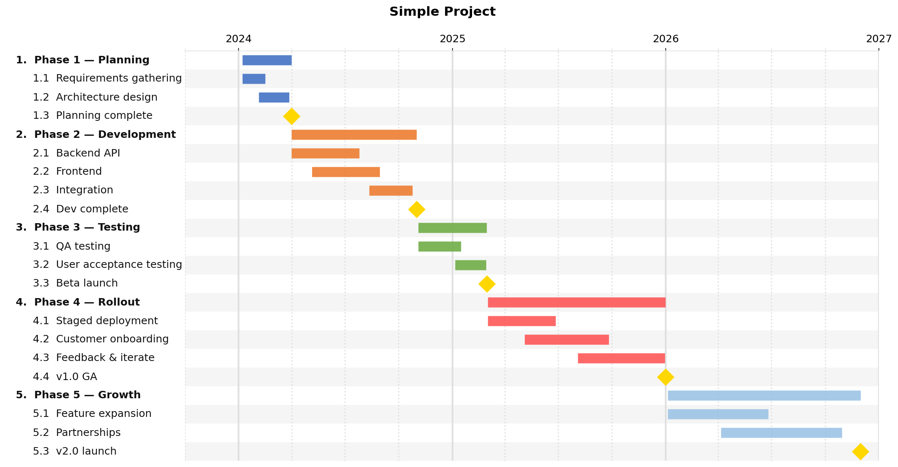
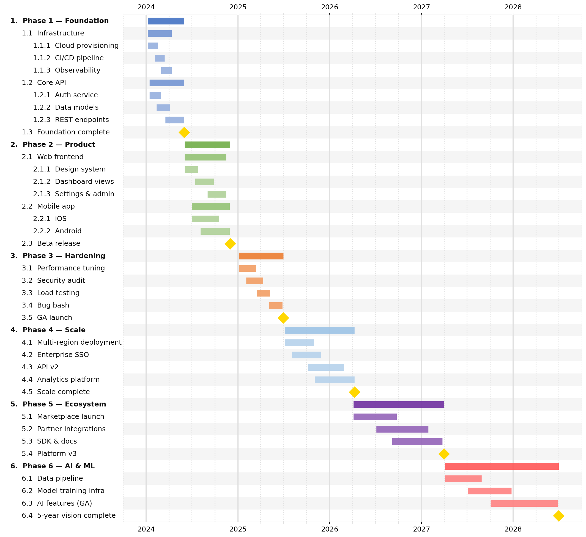
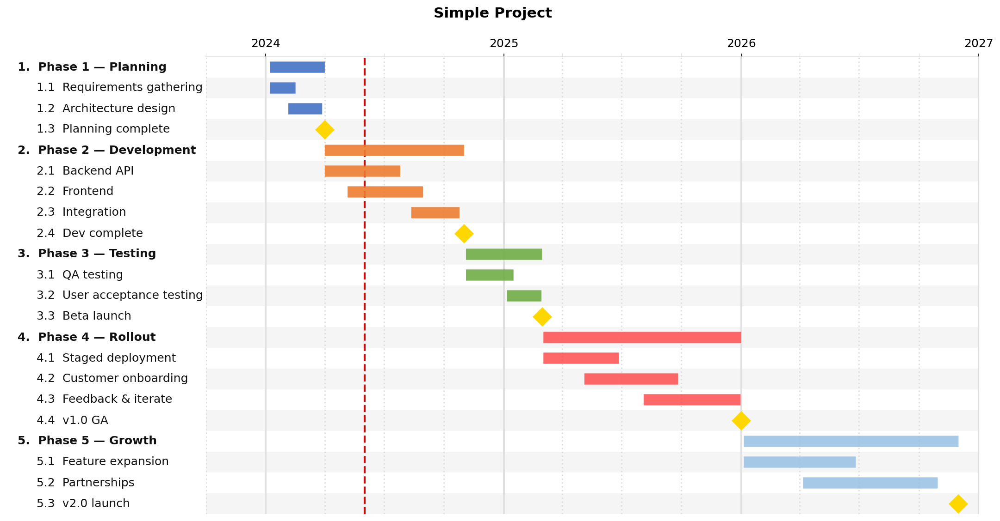
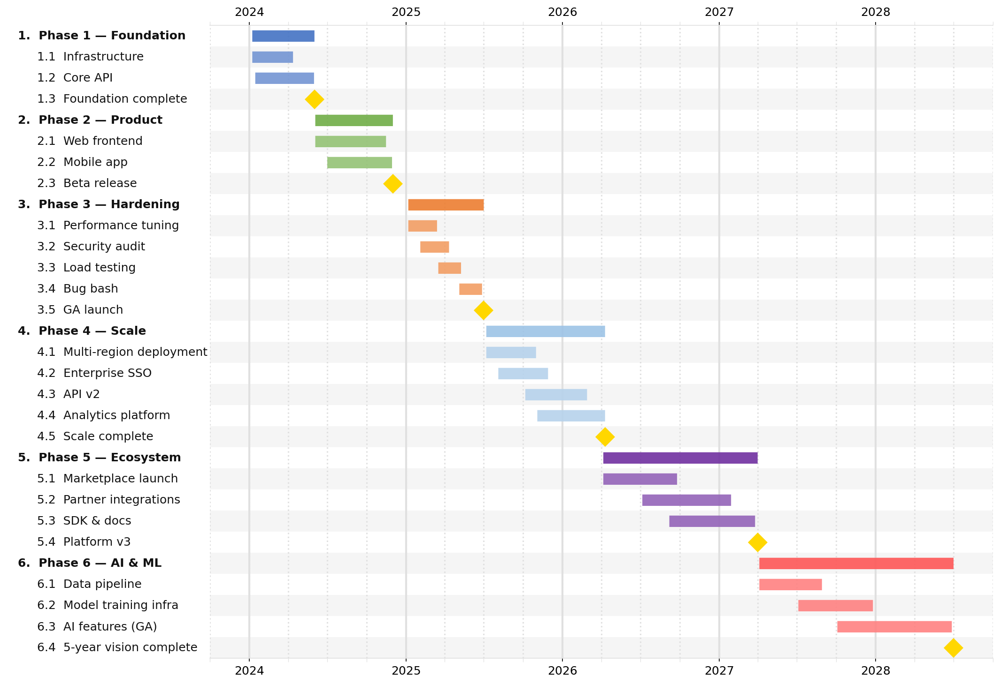
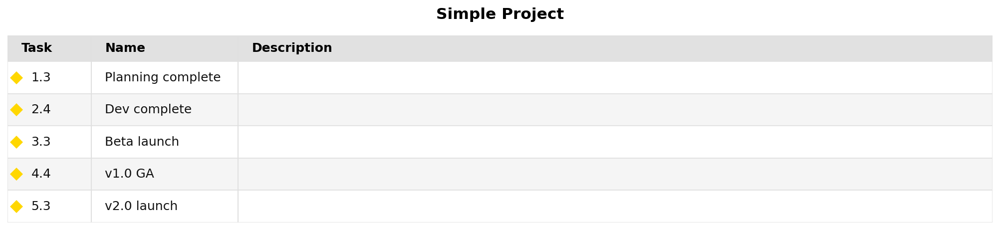

Examples
========

The ``examples/`` directory in the repository contains three ready-to-run examples,
and ``docs/examples/`` contains the smaller fixtures used in this manual.
Each is self-contained — copy, edit, and run with ``jsonantt``.

.. code-block:: bash

   jsonantt examples/simple.json       /tmp/simple.png
   jsonantt examples/complex.json      /tmp/complex.png
   jsonantt examples/dependencies.json /tmp/deps.png

----

simple.json — three-year project plan
--------------------------------------

**What it shows:** a clean multi-phase project with nested milestones, year/quarter ticks,
and the default color palette.

Key fields used
~~~~~~~~~~~~~~~

.. list-table::
   :widths: 30 70
   :header-rows: 1

   * - Field
     - Role in this example
   * - ``title``
     - Chart heading
   * - ``dateformat``
     - ``"%Y-%m-%d"`` — ISO dates throughout
   * - ``style.major_tick``
     - ``"year"`` — bold annual gridlines with labels
   * - ``style.minor_tick``
     - ``"quarter"`` — lighter quarterly gridlines
   * - ``task.children``
     - Phase tasks have no dates; span derives from children
   * - ``task.start`` / ``task.end``
     - Leaf tasks use explicit date ranges
   * - ``task.milestone``
     - ``true`` — renders a diamond marker instead of a bar
   * - ``task.date``
     - The exact date the milestone falls on
   * - ``task.color``
     - ``"#FFD700"`` — gold override on each milestone

JSON
~~~~

.. code-block:: json

   {
     "title": "Simple Project",
     "dateformat": "%Y-%m-%d",
     "style": {
       "major_tick": "year",
       "minor_tick": "quarter"
     },
     "tasks": [
       {
         "name": "Phase 1 — Planning",
         "children": [
           { "name": "Requirements gathering", "start": "2024-01-08", "end": "2024-02-16" },
           { "name": "Architecture design",    "start": "2024-02-05", "end": "2024-03-28" },
           { "name": "Planning complete", "milestone": true, "date": "2024-04-01",
             "color": "#FFD700" }
         ]
       },
       {
         "name": "Phase 2 — Development",
         "children": [
           { "name": "Backend API",  "start": "2024-04-01", "end": "2024-07-26" },
           { "name": "Frontend",     "start": "2024-05-06", "end": "2024-08-30" },
           { "name": "Integration",  "start": "2024-08-12", "end": "2024-10-25" },
           { "name": "Dev complete", "milestone": true, "date": "2024-11-01",
             "color": "#FFD700" }
         ]
       }
     ]
   }

Output
~~~~~~

----

complex.json — five-year engineering roadmap
---------------------------------------------

**What it shows:** three levels of nesting, ``subtask_lightening_pct`` for color inheritance,
``tick_position: "both"`` to label ticks on both axes, and no ``title`` for a tighter layout.

Key fields used
~~~~~~~~~~~~~~~

.. list-table::
   :widths: 30 70
   :header-rows: 1

   * - Field
     - Role in this example
   * - ``title`` *(omitted)*
     - Removing the title eliminates dead whitespace at the top
   * - ``style.row_height``
     - ``0.3`` — compact rows for a tall chart
   * - ``style.font_size``
     - ``12`` — slightly larger than the default for a presentation-ready chart
   * - ``style.indent_size``
     - ``3`` — spaces added per depth level in the label column
   * - ``style.subtask_lightening_pct``
     - ``25`` — each nesting level inherits the parent color, lightened 25%
   * - ``style.major_tick`` / ``style.minor_tick``
     - ``"year"`` / ``"quarter"``
   * - ``style.tick_position``
     - ``"both"`` — tick labels appear at top **and** bottom (useful for tall charts)
   * - ``task.color``
     - Set on each top-level phase; children inherit and auto-lighten
   * - ``task.description``
     - Stored on each task; available in table output via ``table_columns``
   * - Three nesting levels
     - Phase → Group → Leaf; summary bars auto-span all descendants

JSON (abbreviated — see ``examples/complex.json`` for the full file)
~~~~~~~~~~~~~~~~~~~~~~~~~~~~~~~~~~~~~~~~~~~~~~~~~~~~~~~~~~~~~~~~~~~~~

.. code-block:: json

   {
     "dateformat": "%Y-%m-%d",
     "style": {
       "row_height": 0.3,
       "font_size": 12,
       "indent_size": 3,
       "subtask_lightening_pct": 25,
       "major_tick": "year",
       "minor_tick": "quarter",
       "tick_position": "both"
     },
     "tasks": [
       {
         "name": "Phase 1 — Foundation",
         "color": "#4472C4",
         "children": [
           {
             "name": "Infrastructure",
             "children": [
               { "name": "Cloud provisioning", "start": "2024-01-08", "end": "2024-02-16" },
               { "name": "CI/CD pipeline",     "start": "2024-02-05", "end": "2024-03-15" }
             ]
           },
           {
             "name": "Foundation complete",
             "milestone": true, "date": "2024-06-01", "color": "#FFD700"
           }
         ]
       }
     ]
   }

Output
~~~~~~

----

dependencies.json — chained scheduling with ``not_before``
-----------------------------------------------------------

**What it shows:** an entire schedule built from a single hard start date and duration
chains — no end dates written by hand.

Key fields used
~~~~~~~~~~~~~~~

.. list-table::
   :widths: 30 70
   :header-rows: 1

   * - Field
     - Role in this example
   * - ``task.id``
     - Unique identifier for each task so others can reference it
   * - ``task.start``
     - Only the first task needs a hard start date
   * - ``task.duration``
     - All tasks use durations (``"3m"``, ``"6m"``, ``"6w"``, …) instead of end dates
   * - ``task.not_before``
     - Links a task's start to another task's effective end — cascades automatically
   * - ``style.width``
     - ``16`` inches — wider figure for a schedule that spans ~18 months
   * - ``style.major_tick`` / ``style.minor_tick``
     - ``"year"`` / ``"quarter"``

JSON
~~~~

.. code-block:: json

   {
     "title": "Dependency Example — start/duration and not_before",
     "dateformat": "%Y-%m-%d",
     "style": {
       "width": 16,
       "major_tick": "year",
       "minor_tick": "quarter"
     },
     "tasks": [
       {
         "id": "design",   "name": "Design",
         "start": "2024-01-06", "duration": "3m", "color": "#4472C4",
         "children": [
           { "id": "wireframes", "name": "Wireframes",
             "start": "2024-01-06", "duration": "6w" },
           { "id": "mockups",    "name": "Mockups",
             "not_before": "wireframes", "duration": "6w" }
         ]
       },
       { "id": "backend",  "name": "Backend development",
         "not_before": "design",  "duration": "6m", "color": "#70AD47" },
       { "id": "frontend", "name": "Frontend development",
         "not_before": "design",  "duration": "5m", "color": "#ED7D31" },
       { "id": "qa",       "name": "QA & testing",
         "not_before": "backend", "duration": "3m", "color": "#FF5757" },
       { "id": "rollout",  "name": "Staged rollout",
         "not_before": "qa",      "duration": "4m", "color": "#9DC3E6" }
     ]
   }

Output
~~~~~~

.. image:: _static/img/example-dependencies.png
   :alt: dependencies.json rendered output
   :width: 100%

----

Recipes
-------

Add a vertical "today" line
~~~~~~~~~~~~~~~~~~~~~~~~~~~

.. code-block:: bash

   jsonantt project.json chart.png --date-line today

Render at higher resolution for print
~~~~~~~~~~~~~~~~~~~~~~~~~~~~~~~~~~~~~~

.. code-block:: bash

   jsonantt project.json chart.pdf --dpi 300

Show only the top two nesting levels
~~~~~~~~~~~~~~~~~~~~~~~~~~~~~~~~~~~~~

.. code-block:: bash

   jsonantt project.json chart.png --renderdepth 2

Generate a milestone-only status summary
~~~~~~~~~~~~~~~~~~~~~~~~~~~~~~~~~~~~~~~~~

.. code-block:: bash

   jsonantt -t project.json milestones.png --milestones-only

Compare a baseline with an updated schedule
~~~~~~~~~~~~~~~~~~~~~~~~~~~~~~~~~~~~~~~~~~~

.. code-block:: bash

   jsonantt planned.json compare.png --compare actual.json

.. image:: _static/img/compare.png
   :alt: Baseline vs actual comparison chart
   :width: 100%

Generate a monthly cost burn chart
~~~~~~~~~~~~~~~~~~~~~~~~~~~~~~~~~~~

Add a ``"cost"`` field to each task (e.g. ``"cost": 50000``), then:

.. code-block:: bash

   jsonantt project.json burn.png \
     --burn --burn-field cost --burn-period month --burn-group 0

.. image:: _static/img/burn.png
   :alt: Monthly cost burn chart
   :width: 100%
