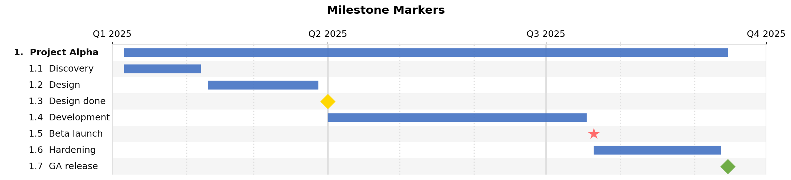

JSON Reference
==============

A jsonantt file is a single JSON object with the following top-level keys.

Top-level fields
----------------

.. list-table::
   :widths: 20 15 15 50
   :header-rows: 1

   * - Field
     - Type
     - Default
     - Description
   * - ``tasks``
     - array
     - **required**
     - Ordered list of :ref:`task objects <task-object>`.
   * - ``title``
     - string
     - ``""``
     - Chart title. Omit to render without a title and without wasting vertical whitespace.
   * - ``dateformat``
     - string
     - ``"%Y-%m-%d"``
     - ``strftime`` format string used to parse all dates in the file.
   * - ``start``
     - string
     - auto
     - Force the x-axis start date (overrides the earliest task date).
   * - ``end``
     - string
     - auto
     - Force the x-axis end date (overrides the latest task date).
   * - ``style``
     - object
     - see :doc:`style-guide`
     - Visual style overrides. See :doc:`style-guide` for all fields.
   * - ``arrows``
     - array
     - ``[]``
     - List of :ref:`arrow objects <arrow-object>` drawn as dependency lines.

.. _task-object:

Task object
-----------

Each entry in ``tasks`` (and each entry in a task's ``children`` array) is a task object.

.. list-table::
   :widths: 22 15 13 50
   :header-rows: 1

   * - Field
     - Type
     - Default
     - Description
   * - ``name``
     - string
     - **required**
     - Display label for the task.
   * - ``description``
     - string
     - ``""``
     - Optional long description (unused in chart output, available in table columns).
   * - ``id``
     - string
     - —
     - Unique identifier used in ``not_before`` references and ``arrows``.
   * - ``start``
     - string
     - —
     - Start date in ``dateformat``. Required unless derived from children or ``not_before``.
   * - ``end``
     - string
     - —
     - End date in ``dateformat``. Omit when using ``duration``.
   * - ``duration``
     - string
     - —
     - Duration relative to ``start`` or the end of the ``not_before`` task. Format: ``<N><unit>``. See duration units table below.
   * - ``not_before``
     - string
     - —
     - ``id`` of another task. This task's ``start`` is automatically set to that task's effective end date. Must be paired with ``duration``.
   * - ``color``
     - string
     - palette
     - Hex color for this task's bar or milestone marker. Children without an explicit ``color`` inherit this value (and can be auto-lightened via ``subtask_lightening_pct``).
   * - ``milestone``
     - boolean
     - ``false``
     - When ``true`` the task is rendered as a diamond marker, not a bar.
   * - ``date``
     - string
     - —
     - The milestone date. Used only when ``milestone: true``.

Milestone field summary
~~~~~~~~~~~~~~~~~~~~~~~

.. list-table::
   :widths: 22 15 13 50
   :header-rows: 1

   * - Field
     - Type
     - Default
     - Description
   * - ``milestone``
     - boolean
     - ``false``
     - Render as a marker instead of a bar
   * - ``date``
     - string
     - —
     - Point-in-time date for the milestone
   * - ``color``
     - string
     - style default
     - Marker fill color (e.g. ``"#FFD700"``)
   * - ``marker``
     - string
     - ``"D"``
     - Matplotlib marker: ``"D"`` diamond, ``"*"`` star, ``"^"`` triangle
   * - ``marker_size``
     - number
     - ``14.0``
     - Override marker size in points

Example: milestones with different markers
~~~~~~~~~~~~~~~~~~~~~~~~~~~~~~~~~~~~~~~~~~~

.. code-block:: json

   {
     "title": "Milestone Markers",
     "dateformat": "%Y-%m-%d",
     "style": { "major_tick": "quarter", "minor_tick": "month" },
     "tasks": [{
       "name": "Project Alpha",
       "children": [
         { "name": "Discovery",   "start": "2025-01-06", "end": "2025-02-07" },
         { "name": "Design done", "milestone": true, "date": "2025-04-01",
           "color": "#FFD700" },
         { "name": "Development", "start": "2025-04-01", "end": "2025-07-18" },
         { "name": "Beta launch", "milestone": true, "date": "2025-07-21",
           "color": "#FF6B6B", "marker": "*", "marker_size": 16 },
         { "name": "GA release",  "milestone": true, "date": "2025-09-15",
           "color": "#70AD47" }
       ]
     }]
   }

Other task fields
~~~~~~~~~~~~~~~~~

.. list-table::
   :widths: 22 15 13 50
   :header-rows: 1

   * - Field
     - Type
     - Default
     - Description
   * - ``bold``
     - boolean
     - ``false``
     - Force bold label text on this task (independent of ``bold_tasks``).
   * - ``marker``
     - string
     - ``"D"``
     - Matplotlib marker symbol for milestones. ``"D"`` = diamond, ``"*"`` = star, ``"^"`` = triangle, etc.
   * - ``marker_size``
     - number
     - style default
     - Override the milestone marker size in points for this task only.
   * - ``children``
     - array
     - ``[]``
     - Nested sub-tasks. A task with children derives its ``start``/``end`` from the earliest/latest child dates. The bar is rendered as a summary bar (thinner, with a different appearance).
   * - *(any)*
     - any
     - —
     - Any additional field is stored on the task and is accessible as a table column via ``style.table_columns``.
       Example: ``"cost": 50000``, ``"owner": "Alice"``.

Duration units
~~~~~~~~~~~~~~

.. list-table::
   :widths: 15 25 60
   :header-rows: 1

   * - Suffix
     - Unit
     - Behaviour
   * - ``d``
     - Days
     - Exact calendar days. ``"14d"`` = 14 days.
   * - ``w``
     - Weeks
     - 7 calendar days each. ``"2w"`` = 14 days.
   * - ``m``
     - Months
     - Calendar months. ``"3m"`` from Jan 6 ends Apr 6.
   * - ``y``
     - Years
     - Calendar years. ``"1y"`` from Jan 1 2024 ends Jan 1 2025.

Examples: ``"90d"``, ``"3m"``, ``"2w"``, ``"1y"``, ``"18m"``.

Duration and chaining example
~~~~~~~~~~~~~~~~~~~~~~~~~~~~~

.. code-block:: json

   {
     "title": "Duration & not_before Scheduling",
     "dateformat": "%Y-%m-%d",
     "tasks": [
       { "id": "design",   "name": "Design",
         "start": "2025-01-06", "duration": "2m", "color": "#4472C4" },
       { "id": "backend",  "name": "Backend",
         "not_before": "design", "duration": "3m", "color": "#70AD47" },
       { "id": "frontend", "name": "Frontend",
         "not_before": "design", "duration": "2m", "color": "#ED7D31" },
       { "id": "qa",       "name": "QA & Testing",
         "not_before": "backend", "duration": "6w", "color": "#FF5757" }
     ]
   }

.. image:: _static/img/durations.png
   :alt: Duration and not_before chaining
   :width: 100%

Date resolution order
~~~~~~~~~~~~~~~~~~~~~

jsonantt resolves each task's start and end using the first applicable rule:

1. **Explicit** ``start`` + ``end`` — used as-is.
2. **Duration** ``start`` + ``duration`` — ``end`` is computed.
3. **Chain** ``not_before`` + ``duration`` — ``start`` is set to the effective end of the referenced task; ``end`` is then computed.
4. **Parent** — a task with no dates and no ``not_before``/``duration`` derives its range from its ``children``.

.. _arrow-object:

Arrow object
------------

Arrows draw dependency lines between tasks in chart mode.

.. list-table::
   :widths: 20 15 15 50
   :header-rows: 1

   * - Field
     - Type
     - Default
     - Description
   * - ``from``
     - string
     - **required**
     - ``id`` of the source task.
   * - ``to``
     - string
     - **required**
     - ``id`` of the destination task.
   * - ``color``
     - string
     - ``"#888888"``
     - Hex color for the arrow line.
   * - ``label``
     - string
     - —
     - Optional text label drawn alongside the arrow.

Minimal example
---------------

.. code-block:: json

   {
     "dateformat": "%Y-%m-%d",
     "tasks": [
       {
         "name": "Project",
         "children": [
           { "name": "Kick-off",  "start": "2025-01-06", "end": "2025-01-17" },
           { "name": "Delivery",  "milestone": true, "date": "2025-06-30", "color": "#FFD700" }
         ]
       }
     ]
   }

Full skeleton
-------------

.. code-block:: json

   {
     "title": "My Project",
     "dateformat": "%Y-%m-%d",
     "start": "2025-01-01",
     "end":   "2025-12-31",
     "style": {
       "major_tick": "year",
       "minor_tick": "quarter"
     },
     "tasks": [
       {
         "id": "phase1",
         "name": "Phase 1",
         "color": "#4472C4",
         "children": [
           {
             "id": "task-a",
             "name": "Task A",
             "start": "2025-01-06",
             "duration": "6w"
           },
           {
             "id": "task-b",
             "name": "Task B",
             "not_before": "task-a",
             "duration": "2m"
           },
           {
             "name": "Phase 1 done",
             "milestone": true,
             "date": "2025-04-01",
             "color": "#FFD700"
           }
         ]
       }
     ],
     "arrows": [
       { "from": "task-a", "to": "task-b", "color": "#666666" }
     ]
   }
