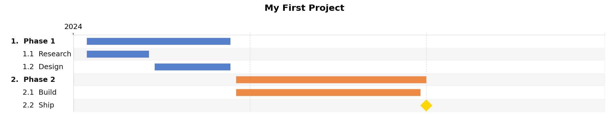
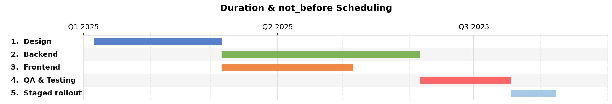
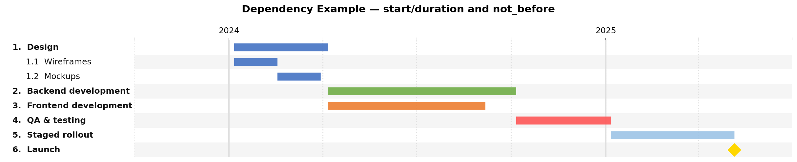
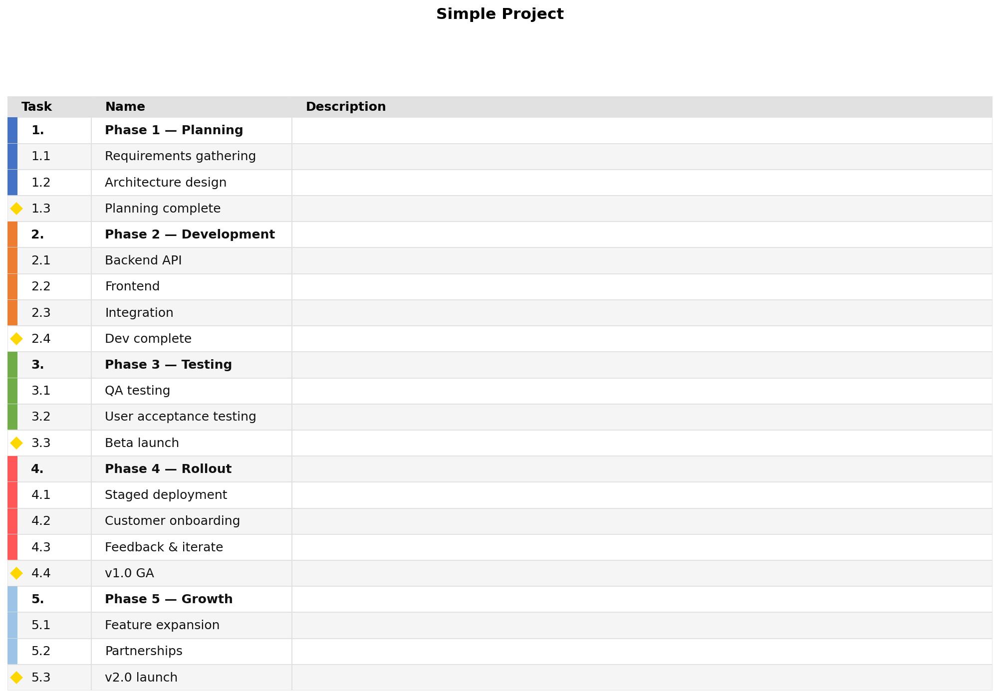
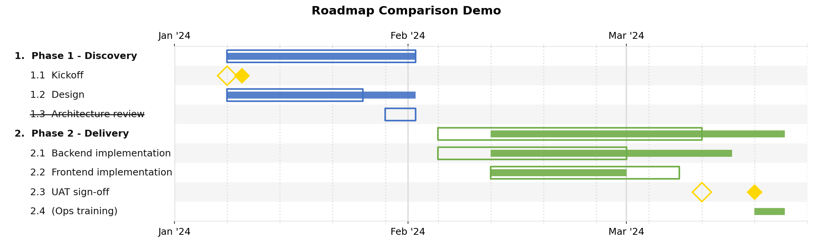
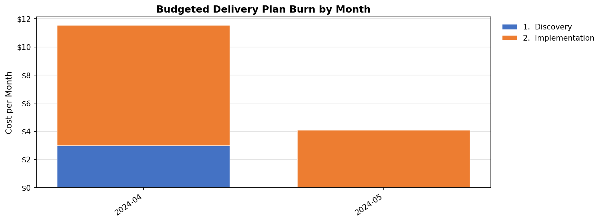

Quickstart
==========

Install
-------

.. code-block:: bash

   pip install jsonantt

jsonantt requires Python 3.8+ and depends only on ``matplotlib``.

Your first chart
----------------

Create a file called ``project.json``:

.. code-block:: json

   {
     "title": "My First Project",
     "dateformat": "%Y-%m-%d",
     "tasks": [
       {
         "name": "Phase 1",
         "children": [
           { "name": "Research",  "start": "2024-01-08", "end": "2024-02-09" },
           { "name": "Design",    "start": "2024-02-12", "end": "2024-03-22" }
         ]
       },
       {
         "name": "Phase 2",
         "children": [
           { "name": "Build",     "start": "2024-03-25", "end": "2024-06-28" },
           { "name": "Ship",      "milestone": true, "date": "2024-07-01", "color": "#FFD700" }
         ]
       }
     ]
   }

Then run:

.. code-block:: bash

   jsonantt project.json chart.png

Open ``chart.png`` — you have a Gantt chart.

Adding tick marks and style
---------------------------

Wrap your tasks with a ``style`` block to control fonts, gridlines, and tick marks:

.. code-block:: json

   {
     "title": "My First Project",
     "dateformat": "%Y-%m-%d",
     "style": {
       "major_tick": "year",
       "minor_tick": "quarter",
       "tick_position": "top",
       "font_size": 11
     },
     "tasks": [ "..." ]
   }

See :doc:`style-guide` for every available style field.

Using durations instead of end dates
-------------------------------------

Instead of a hard ``end`` date, specify a ``duration``:

.. code-block:: json

   { "name": "Sprint 1", "start": "2024-01-08", "duration": "2w" }

Duration units:

.. list-table::
   :widths: 15 85
   :header-rows: 1

   * - Suffix
     - Meaning
   * - ``d``
     - Calendar days
   * - ``w``
     - Weeks (7 days each)
   * - ``m``
     - Calendar months
   * - ``y``
     - Calendar years

Chaining tasks with ``not_before``
------------------------------------

Give tasks an ``id`` and use ``not_before`` to automatically start a task after another ends:

.. code-block:: json

   {
     "tasks": [
       { "id": "design",  "name": "Design",      "start": "2024-01-06", "duration": "3m" },
       { "id": "backend", "name": "Backend",      "not_before": "design", "duration": "6m" },
       { "id": "qa",      "name": "QA & Testing", "not_before": "backend", "duration": "2m" }
     ]
   }

``not_before`` also works with parent-task IDs — it will start after the latest child end.

Render a task table
-------------------

.. code-block:: bash

   jsonantt -t project.json table.png

Add ``--milestones-only`` to show only milestone rows, or ``--no-milestones`` to hide them.

Compare two schedules
---------------------

.. code-block:: bash

   jsonantt planned.json compare.png --compare actual.json

The ``planned.json`` baseline is shown in full opacity; ``actual.json`` deviations appear alongside it.

Burn chart
----------

If tasks carry a numeric field (e.g. ``"cost": 50000``), generate a funded burn-down chart:

.. code-block:: bash

   jsonantt project.json burn.png --burn --burn-field cost --burn-period month --burn-group 0

Next steps
----------

.. list-table::
   :widths: 30 70
   :header-rows: 0

   * - :doc:`json-reference`
     - Every field you can put in a JSON file, with a full skeleton example
   * - :doc:`style-guide`
     - Every ``style`` option with defaults, sub-tables, and a complete reference block
   * - :doc:`cli`
     - Full command-line reference with a quick-reference table
   * - :doc:`examples`
     - Annotated walkthroughs of the three bundled examples plus common recipes
