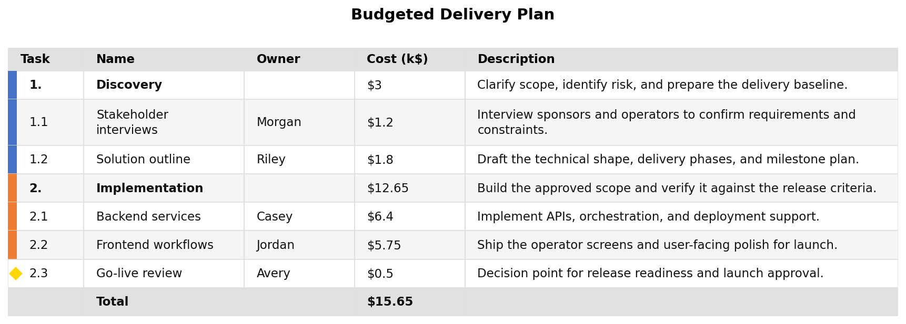
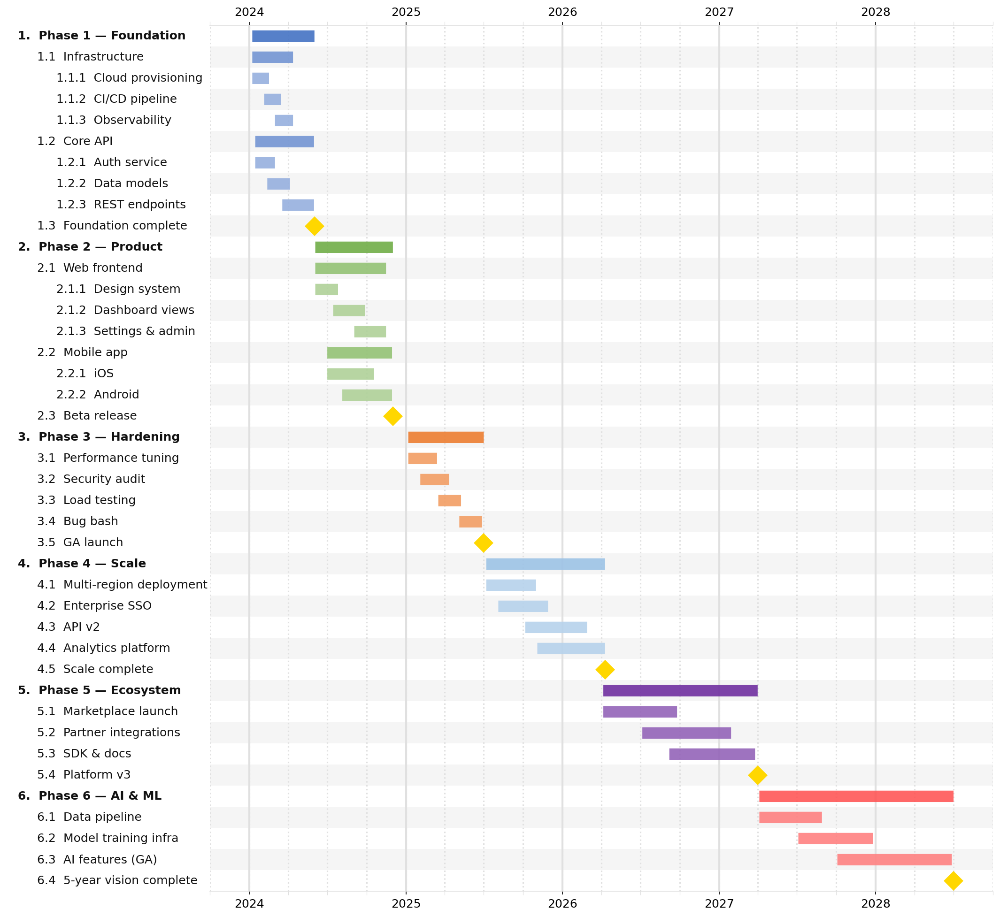

Style Guide
===========

All style fields live inside the ``"style"`` object at the top level of your JSON file.
Every field is optional — the defaults produce a clean, publication-ready chart with no configuration needed.

.. code-block:: json

   {
     "style": {
       "major_tick": "year",
       "minor_tick": "quarter",
       "font_size": 11
     },
     "tasks": [ "..." ]
   }

All fields at a glance
----------------------

.. list-table::
   :widths: 28 16 14 42
   :header-rows: 1

   * - Field
     - Category
     - Default
     - Purpose
   * - ``width``
     - Layout
     - ``14.0``
     - Figure width in inches
   * - ``row_height``
     - Layout
     - ``0.3``
     - Row height in inches
   * - ``bar_height``
     - Layout
     - ``0.5``
     - Bar height as fraction of row height
   * - ``label_fraction``
     - Layout
     - ``0.0``
     - Label panel width (0 = auto)
   * - ``indent_size``
     - Layout
     - ``3``
     - Spaces added per nesting depth
   * - ``font_size``
     - Typography
     - ``12.0``
     - Base font size in points
   * - ``render_depth``
     - Layout
     - ``0``
     - Visible nesting depth for Gantt and Table; 0 shows all levels. CLI ``--renderdepth`` overrides this value
   * - ``show_arrows``
     - Display
     - ``true``
     - Show dependency arrows on the Gantt, without removing their source definitions
   * - ``today_marker``
     - Display
     - ``false``
     - Draw today's date on Gantt output; explicit CLI ``--date-line`` takes precedence
   * - ``bold_tasks``
     - Typography
     - ``true``
     - Auto-bold top-level task labels
   * - ``number_tasks``
     - Typography
     - ``true``
     - Prefix labels with hierarchy numbers
   * - ``task_number_start``
     - Typography
     - ``1``
     - Starting top-level task number (non-negative integer); child numbering still starts at 1
   * - ``milestone_number_start``
     - Typography
     - ``1``
     - Independent starting number when ``number_milestones`` is enabled
   * - ``milestone_prefix``
     - Typography
     - ``"M"``
     - Prefix for numbered milestones; ``""`` means numbers only
   * - ``background``
     - Colors
     - ``"#FFFFFF"``
     - Figure background color
   * - ``grid_color``
     - Colors
     - ``"#E0E0E0"``
     - Vertical gridline color
   * - ``row_band_color``
     - Colors
     - ``"#F5F5F5"``
     - Alternating row band fill
   * - ``colors``
     - Colors
     - 10-color palette
     - Auto-cycle colors for top-level tasks
   * - ``subtask_lightening_pct``
     - Colors
     - ``0.0``
     - Lighten child colors per depth level (%)
   * - ``milestone_color``
     - Milestones
     - ``"#FFD700"``
     - Default milestone marker color
   * - ``milestone_marker``
     - Milestones
     - ``"D"``
     - Default milestone marker symbol
   * - ``milestone_size``
     - Milestones
     - ``14.0``
     - Default milestone marker size (pts)
   * - ``major_tick``
     - Ticks
     - ``null``
     - Major tick interval (year/quarter/month/week/day)
   * - ``minor_tick``
     - Ticks
     - ``null``
     - Minor tick interval (year/quarter/month/week/day)
   * - ``fiscal_year_start``
     - Ticks
     - ``null``
     - Fiscal year start as ``"MM"`` or ``"MM-DD"`` (e.g. ``"10-01"``). Year/quarter ticks snap to the fiscal calendar and are labelled ``FY26`` / ``Q1 FY26`` (fiscal years are named after the calendar year they end in)
   * - ``major_grid_width``
     - Ticks
     - ``2.0``
     - Major gridline linewidth
   * - ``minor_grid_width``
     - Ticks
     - ``1.5``
     - Minor gridline linewidth
   * - ``tick_position``
     - Ticks
     - ``"top"``
     - Tick label position: top / bottom / both
   * - ``table_colorize``
     - Table
     - ``true``
     - Show color accent gutter in table output
   * - ``table_show_markers``
     - Table
     - ``true``
     - Draw milestone markers in table output
   * - ``table_columns``
     - Table
     - ``[]``
     - Custom ordered column definitions

Currency and value units (optional)
-----------------------------------

Use chart-wide value display settings to show costs as dollars, thousands,
millions, or billions without changing source numbers or calculations:

.. code-block:: json

   {
     "style": {
       "value_prefix": "$",
       "value_scale": "millions",
       "value_decimals": 2,
       "value_fields": ["cost"]
     }
   }

A cost of ``1250000`` displays as **$1.25M**. The same formatting is used for
Burn/Burndown/Burnup axis labels, interactive tooltips, budget-line tooltips,
Table/Burn table cells and totals, and PNG/SVG/CSV exports. Graph axis/unit labels
identify the currency and scale. Date labels, task numbers, and IDs are unaffected.

.. list-table::
   :header-rows: 1
   :widths: 25 20 55

   * - Field
     - Default
     - Meaning
   * - ``value_prefix``
     - ``null``
     - Prefix such as ``$``, ``€``, or a currency code followed by a space. Null preserves an existing source prefix.
   * - ``value_scale``
     - ``"units"``
     - ``units``, ``thousands`` (K), ``millions`` (M), or ``billions`` (B). Divides displayed values by 1, 1,000, 1,000,000, or 1,000,000,000 respectively.
   * - ``value_suffix``
     - ``null``
     - Optional unit annotation such as ``USD`` or ``thousand``; does not scale values. Null preserves an existing source suffix.
   * - ``value_decimals``
     - ``null``
     - Fixed decimal places from 0 to 8. Null uses up to two places when this formatting is enabled.
   * - ``value_fields``
     - ``["cost"]``
     - Fields receiving this formatting. For example, ``["cost", "budget"]`` leaves effort unchanged. ``[]`` applies to all numeric amount fields, excluding structural IDs/dates/durations.

With all formatting options at their defaults, existing output is unchanged.
Enabling a prefix, suffix, scale, or decimal override opts the selected fields in.
Rounding is display-only, using ties-to-even; raw values, sums, and allocations
are never rounded or rewritten by these settings.

Existing ``display_factor`` / ``--burn-display-factor`` multipliers still apply
first. Avoid scaling twice: if your source numbers already represent thousands
(or an existing multiplier has converted them), leave ``value_scale`` as
``"units"`` and set ``value_suffix`` to ``"thousand"``. For example, ``1250``
then displays as ``$1,250 thousand`` without changing its magnitude.

All five controls are available under **Chart settings → Value display**.

Layout
------

.. list-table::
   :widths: 30 15 55
   :header-rows: 1

   * - Field
     - Default
     - Description
   * - ``width``
     - ``14.0``
     - Figure width in inches. Increase for wide date ranges or many columns.
   * - ``row_height``
     - ``0.3``
     - Height of each row in inches. Lower values produce a more compact chart.
   * - ``bar_height``
     - ``0.5``
     - Bar height as a fraction of ``row_height``. ``0.5`` means the bar occupies half the row.
   * - ``label_fraction``
     - ``0.0``
     - Width of the task label panel as a fraction of the total figure width. ``0.0`` (default) auto-sizes the panel to fit the longest label.
   * - ``indent_size``
     - ``3``
     - Number of extra space characters added per nesting depth in the label panel.

Typography
----------

.. list-table::
   :widths: 30 15 55
   :header-rows: 1

   * - Field
     - Default
     - Description
   * - ``font_size``
     - ``12.0``
     - Base font size in points, applied to both task labels and tick labels.
   * - ``bold_tasks``
     - ``true``
     - When ``true``, depth-0 (top-level) task labels are automatically rendered in bold. Individual tasks can override this with the ``bold`` field.
   * - ``number_tasks``
     - ``true``
     - Prefix task labels with hierarchical numbers (``1``, ``1.1``, ``1.1.1``, …).
   * - ``task_number_start``
     - ``1``
     - Starting top-level number. For ``5``, the hierarchy becomes ``5``, ``5.1``, ``5.2``, ``6``, etc. Applies to Gantt, task tables, burn outputs and comparisons, including CSV. IDs, dependencies, colours and separate ``M1`` milestone numbering are unchanged.

For example, continue numbering after tasks in another document:

.. code-block:: json

   {"style": {"number_tasks": true, "task_number_start": 5}}

Omitting ``task_number_start`` preserves the existing numbering starting at 1.
The CLI and Python/HTTP APIs read this source setting without new flags. In the
GUI use **Chart settings → Labels and display → Starting task number**. Filtering
or rolling up rows does not renumber them. Composed tasks use the destination
chart's numbering; comparison output keeps the baseline numbers for matched rows.

Milestone numbering is independent. Enable ``number_milestones`` and set
``milestone_number_start`` (a non-negative integer) and ``milestone_prefix`` (a
string, including ``""`` for no prefix). For example:

.. code-block:: json

   {
     "style": {
       "task_number_start": 5,
       "number_milestones": true,
       "milestone_number_start": 10,
       "milestone_prefix": "G"
     }
   }

Tasks start at 5 and milestone labels are ``G10``, ``G11``, etc. Use an empty
prefix for ``10``, ``11``, etc. Labels are shared by Gantt markers, rolled-up
milestones, tables, comparisons and exports. Existing milestone-chain and visible
row counting rules are unchanged. These controls are in **Chart settings →
Milestones**; clearing the prefix saves an empty string, while Reset restores
``M``. Defaults remain ``M1``, ``M2``, etc.

Colors
------

.. list-table::
   :widths: 30 15 55
   :header-rows: 1

   * - Field
     - Default
     - Description
   * - ``background``
     - ``"#FFFFFF"``
     - Figure and axes background color.
   * - ``grid_color``
     - ``"#E0E0E0"``
     - Color of all vertical gridlines.
   * - ``row_band_color``
     - ``"#F5F5F5"``
     - Alternating row band fill color (every other row is tinted). Also used as the label panel background tint.
   * - ``colors``
     - see below
     - Ordered list of hex colors automatically cycled across top-level tasks that have no explicit ``color``. The default palette is 10 colors (steel blue, orange, green, coral, sky blue, amber, purple, cyan, hot pink, emerald).
   * - ``subtask_lightening_pct``
     - ``0.0``
     - Percentage to lighten a child task's inherited parent color per depth step. ``25`` means each level is 25% lighter. Set to ``0`` to disable.

Milestones
----------

.. list-table::
   :widths: 30 15 55
   :header-rows: 1

   * - Field
     - Default
     - Description
   * - ``milestone_color``
     - ``"#FFD700"``
     - Default fill color for milestone markers when no task-level ``color`` is set.
   * - ``milestone_marker``
     - ``"D"``
     - Default matplotlib marker symbol for milestones. Common options: ``"D"`` (diamond), ``"*"`` (star), ``"^"`` (triangle), ``"o"`` (circle), ``"s"`` (square).
   * - ``milestone_size``
     - ``14.0``
     - Default marker size in points. Override per-task with ``marker_size``.

Tick marks and gridlines
------------------------

jsonantt draws two levels of tick marks: a *major* level (prominent gridlines, bold labels) and a *minor* level (lighter gridlines, no labels).

.. list-table::
   :widths: 30 15 55
   :header-rows: 1

   * - Field
     - Default
     - Description
   * - ``major_tick``
     - ``null``
     - Major tick interval. One of ``"year"``, ``"quarter"``, ``"month"``, ``"week"``, or ``"day"``. ``null`` uses the default yearly ticks.
   * - ``minor_tick``
     - ``null``
     - Minor tick interval. Same values as ``major_tick``. ``null`` uses quarterly ticks. Typically set to a finer interval than ``major_tick``.
   * - ``major_grid_width``
     - ``2.0``
     - Linewidth of major gridlines.
   * - ``minor_grid_width``
     - ``1.5``
     - Linewidth of minor gridlines.
   * - ``tick_position``
     - ``"top"``
     - Where to draw the x-axis tick labels. Options: ``"top"``, ``"bottom"``, or ``"both"``.

Typical tick combinations:

.. list-table::
   :widths: 30 30 40
   :header-rows: 1

   * - ``major_tick``
     - ``minor_tick``
     - Best for
   * - ``"year"``
     - ``"quarter"``
     - Multi-year roadmaps
   * - ``"quarter"``
     - ``"month"``
     - 1–2 year plans
   * - ``"month"``
     - ``"week"``
     - Quarterly sprints
   * - ``"week"``
     - ``"day"``
     - Short-horizon detail

Fiscal calendars
~~~~~~~~~~~~~~~~

Set ``fiscal_year_start`` (for example ``"10-01"`` for a fiscal year starting 1 October)
to switch year and quarter ticks to the fiscal calendar. Ticks then land on the fiscal
boundaries and are labelled with fiscal names — ``FY26`` for years and ``Q1 FY26`` for
quarters. A fiscal year is named after the calendar year in which it ends, so with a
``"10-01"`` start, October 2025 … September 2026 is ``FY26``. Month, week, and day ticks
are unaffected.

.. code-block:: json

   {
     "style": {
       "fiscal_year_start": "10-01",
       "major_tick": "quarter",
       "minor_tick": "month"
     }
   }

Table output
------------

These fields only affect ``-t`` / ``--table`` output.

.. list-table::
   :widths: 30 15 55
   :header-rows: 1

   * - Field
     - Default
     - Description
   * - ``table_colorize``
     - ``true``
     - Show task bar colors as an accent gutter in the table.
   * - ``table_show_markers``
     - ``true``
     - Draw milestone diamond markers in the table output.
   * - ``table_columns``
     - ``[]``
     - Ordered list of column definition objects. Empty list uses the default column set. See sub-table below.

``table_columns`` column definition object
~~~~~~~~~~~~~~~~~~~~~~~~~~~~~~~~~~~~~~~~~~

Each entry in ``table_columns`` is an object with the following fields:

.. list-table::
   :widths: 20 12 18 50
   :header-rows: 1

   * - Field
     - Type
     - Default
     - Description
   * - ``field``
     - string
     - **required**
     - The data key to display. Built-in values: ``name``, ``start``, ``end``, ``duration``. Any custom key stored on a task (e.g. ``cost``, ``owner``) works too.
   * - ``label``
     - string
     - same as ``field``
     - Column header text.
   * - ``width``
     - number
     - auto
     - Column width in pixels.
   * - ``align``
     - string
     - ``"left"``
     - Text alignment: ``"left"``, ``"center"``, or ``"right"``.

.. code-block:: json

   {
     "style": {
       "table_columns": [
         { "field": "name",  "label": "Task",       "width": 220 },
         { "field": "start", "label": "Start",      "width": 100, "align": "center" },
         { "field": "end",   "label": "End",        "width": 100, "align": "center" },
         { "field": "owner", "label": "Owner",      "width": 120 },
         { "field": "cost",  "label": "Budget ($)", "width": 100, "align": "right" }
       ]
     }
   }

Full style example
------------------

This is the style block from the bundled ``complex.json`` example:

.. code-block:: json

   {
     "style": {
       "row_height": 0.3,
       "font_size": 12,
       "indent_size": 3,
       "subtask_lightening_pct": 25,
       "major_tick": "year",
       "minor_tick": "quarter",
       "tick_position": "both"
     }
   }

And a maximally-configured reference block showing every field:

.. code-block:: json

   {
     "style": {
       "width": 16.0,
       "row_height": 0.28,
       "bar_height": 0.5,
       "font_size": 11.0,
       "indent_size": 3,
       "label_fraction": 0.0,
       "subtask_lightening_pct": 20,
       "background": "#FFFFFF",
       "grid_color": "#E0E0E0",
       "row_band_color": "#F5F5F5",
       "milestone_color": "#FFD700",
       "milestone_marker": "D",
       "milestone_size": 14.0,
       "major_tick": "year",
       "minor_tick": "quarter",
       "major_grid_width": 2.0,
       "minor_grid_width": 1.5,
       "tick_position": "top",
       "bold_tasks": true,
       "number_tasks": true,
       "table_colorize": true,
       "table_show_markers": true
     }
   }

